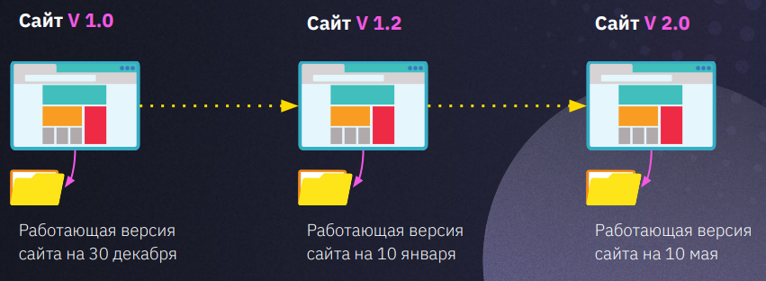
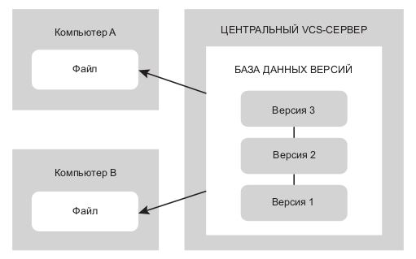
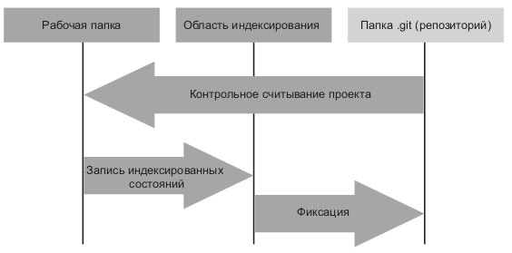

# Конспект-инструкция по Git

## _Дисклеймер_
_Это конспект по git. Конспекты по GitHub и Visual Studio Code оформлены отдельно. Он создавался после лекций и семинаров на [GeekBrains](https://gb.ru/ "Перейти на портал GeekBrains"). Преподаватели: Ильнар Шафигуллин (лекции), Эльвира Аннаева (семинары). Кроме лекций и семинаров для составления конспекта использовалась литература, справочная информация и различные ресурсы в сети._

_В процессе обучения использовалась ОС ALT Linux Desktop. Как будет работать программное обеспечение, описываемое в этом конспекте в другой среде автор не знает и не проверял. Имейте это в виду._

_Начало конспекта: 10.01.2023. Автор: М. Казачкин._
## Контроль версий
---
Конроль версий необходим для **сохранения** различных версий проектов и **возможности** возвращаться к ним. Одним из самых простых способов организовать контроль версий — это копирование файлов с рабочими версиями файлов в отдельные папки (рис. 1).

_**Рис. 1.** Ручной контрль версий копированием файлов_

Подобный способ организации контроля версий рабочий, но не удобный. Особенно проблематично в этом случае организовывать **совместную работу** с другими разработчиками в крупных проектах, занимающих **длительный срок**.

Существует несколько систем контроля версий. Одной из самых распространенных является Git. Изначально был разработан для контроля версий при работе на ядром Linux.

Git относится к распределенным системам контроля версий (Distributed Version Control System, DVCS). Такие системы позволяют не только организовать контроль версий, но и обеспечить совместную работу пользователей над проектами. Программные кленты создают полную зеркальную копию локального **репозитория** пользователя у других пользователей или на VCS-сервере.

_**Рис. 2.** Централизованное управление версиями_

Помимо Git существуют и другие DVCS, например Mercurial, Bazaar или Darcs.
## Git
---
### Общая информация
Для осуществления практически всех операций Git использует локальные файлы. В общем случае информация с других компьютеров не нужна.

Перед сохранением файлов Git рассчитывает контрольную сумму файлов, что делает невозможным изменения файлов без уведомления об этом Git.

Git можно использовать разными способами, однако предпочтительнее работать из командной строки (в терминале).

Работа в терминале позволяет выполнять все команды Git, в то время как большинство графических пользовательских интерфейсов (GUI) имеют ограничения. Кроме того, использование командной строки позволяет добиться единообразия работы с Git на любых системах и не зависить от доступности GUI.

### Три состояния Git
**! Важная информация !**

**Файлы в Git могут находится в трех состояниях:**
1. **Зафиксированные**
2. **Модифицированные**
3. **Индексированные**

_Зафиксированное_ состояние (_commited_) означает, что файлы сохранены в локальной базе данных Git. _Модифицированное_ состояние (_modified_) означает, что файл был изменен, но изменения пока не зафиксированны в базе данных Git. _Индексированное_ состояние файлов (_staged_) означает, что текушая версия модифицированного файла предназначена для фиксации.

Переход файлов из одного состояния в другое продемонстрирован на рис. 3.

_**Рис. 3.** Рабочая папка, область индексирования и папка Git_

Папка `.git` хранит локальную базу данных репозитория и располагается в рабочей папке. Она по-умолчанию скрыта от пользователя.

### Что такое HEAD
В некоторых командах необходимо использовать указатель `HEAD`. `HEAD` — это указатель, ссылающися на уникальный идентификатор фиксации (хэш-код) в текущей ветке фиксаций (рис. 4). 

_**Рис. 4.** Фрагмент вывода команды `git log`. Подчеркнуты идентификаторы фиксаций. Указатель `HEAD` установлен на последнюю фиксацию в ветке master (`HEAD -> master`)._

При каждой последующей фиксации значение `HEAD` в ветке меняется на идентификатор последнего коммита. Однако, значения указателя `HEAD` можно поменять, используя, к примеру, команду `git checkout <branch>`, где `<branch>` — это идентификатор фиксации.

Указанный в `HEAD` коммит будет родителем следующей фиксации в ветке. В рабочей папке проекта, при этом, содержимое файлов будет соответствовать тому коммиту, на который указывает `HEAD`.

Для ссылки на идентификатор обычно хватает первых четырех символов, при условии, что они не дублируются в другом идентификаторе. В противном случае потребуется ввод большего количества символов.

### Ветвление в Git
 Git позволяет производить ветвления. Основной веткой фиксаций в каждом репозитории считается master. При необходимости, например, для разработки дополнительного функционала или исправления ошибок, можно создать отдельную ветку репозитория, в которой производить необходимые изменения кода.

По сути, ветки —  это указатели на коммиты, т. е. слепки состояния файлов в тот или иной момент. При создании новой ветки создается новый указатель. При этом указатель `HEAD` может быть переведен в другую ветку в локальном репозитории. Это позволяет вести параллельную разработку. Другой разработчик в своей локальной копии репозитория может продожать работать над веткой `master`, или создать свою.

В этом случае истории коммитов различных веток будут расходится. После завершения работ необходимо произвести слияние веток. Дополнительные ветки вливаются в ветку `master`.
### Установка Git
Дистрибутив Git можно скачать с [официального сайта](https://git-scm.com/ "Перейти на официальный сайт проекта Git") проекта. В разделе Downloads есть версии для Windows, Mac. 

В Linux необходимо воспользоваться штатным для установленного дистрибутива менеджером пакетов и установить актуальную версию Git из подключенных репозиториев. Список команд установки для конкретных дистрибутивов Linux приведен на странице загрузки.

В общем случае, установка Git в Linux выполняется пользователем root командой

    apt-get install git

Кроме основного пакета для установки из репозиториев, как правило, доступны пакеты с документацией к Git (на английском языке) и дополнительные инструменты, графические интерфейсы и т. п.

### Первая настройка Git

Настройка окружения Git, как правило, проводится один раз. Настройка производится опцией config, параметры которой задают значения переменных Git. Переменные хранятся в разных местах и могут иметь системное (system), пользовательское (global) или локальное значение.

Настройки каждого следующего уровня переопределяют настроки предыдущего. То есть, локальные настройки (файл `gitconfig` располагающийся в папке `.git` проекта) имеют приоритет выше, чем настройки пользователя (файл `~/.gitconfig`. Расположение зависит от дистрибутива).

После установки Git следует указать имя пользователя и адрес электронной почты. Эту информацию Git будет включать в каждую фиксируемую версию и она обязательно будет включаться в коммиты (дополнительная информация при переводе файлов в _фиксированное_ состояние).

Имя пользователя и адрес электронной почты задаются командами

    git config --global user.name "Ivan Smirnoff"
    git config --global user.email smirnoff@example.ru

Если для конкретного проекта требуется указать другие имя и адрес, но необходимо выполнить эти же команды без параметра `--global` в папке проекта.  

    git config user.name "Ivan Smirnoff"
    git config user.email smirnoff@example.ru

Для ввода сообщений Git желательно указать рекдатор, который будет использоваться для их редактирования. Без настройки Git будет использовать редактор по-умолчанию. Обычно это Vim. Однако, не все начинающие (и не только начинающие) могут использовать Vim. Поэтому лучше задать консольный редактор по-умолчанию. 

В Linux наиболее привычным интерфейсом для большинства пользователей обладает редактор консольного файлового менеджера Midnight Commander (mc). Чтобы задать его в качестве редактора по-умолчанию, необходимо выполнить команду

    git config --global core.editor mcedit

Или иную, где вместо `mcedit` вписать нужный редактор.

Проверка настроек осуществляется командой `git config --list`, которая выводит на экран список всех обнаруженных параметров. Например:

    $ git config --list

    user.name=Mikhail Kazachkin
    user.email=mikhail.kazachkin@yandex.ru
    core.editor=mcedit

## Команды Git
---
### git --help
Список всех команд Git, синтаксис их использования и список опций выводится командой `git --help`. Пример:

    $ git --help
    usage: git [--version] [--help] [-C <path>] [-c <name>=<value>]
           [--exec-path[=<path>]] [--html-path] [--man-path] [--info-path]
           [-p | --paginate | -P | --no-pager] [--no-replace-objects] [--bare]
           [--git-dir=<path>] [--work-tree=<path>] [--namespace=<name>]
           [--super-prefix=<path>] [--config-env=<name>=<envvar>]
           <command> [<args>]
    ...

Запуск в терминале команды `git help -a` выведет полный список доступных команд.

### git &lt;command> -h

Команда `git <command> -h` выводит справку по команде `<command>`. Пример:

    $ git init -h
    usage: git init [-q | --quiet] [--bare] [--template=<template-directory>] [--shared[=<permissions>]] [<directory>]
    ...

### git status
Команда `git status` выводит отчет о состоянии файлов репозитория в папке. В том случае, когда в папке присутствуют отслеживаемые файлы в _модифицированные_ или _индексированные_ файлы, выводит их список. Например:

    $ git status
    On branch master
    Changes not staged for commit:
      (use "git add <file>..." to update what will be committed)
      (use "git restore <file>..." to discard changes in working directory)
	    modified:   git_manual.md
    
    no changes added to commit (use "git add" and/or "git commit -a")

Если в папке репозиторий не был инициализирован, то выводится соответствующая информация:

    $ git status
    fatal: not a git repository (or any parent up to mount point /)
    Stopping at filesystem boundary (GIT_DISCOVERY_ACROSS_FILESYSTEM not set).

Полезные опции
* -s, --short — упрощенный вариант вывода. 
### git init
Команда `git init` инициализирует репозиторий в запущенной папке. Резульатом выполнения

    $ git init
    ...
    Initialized empty Git repository in /home/user/example/.git/

будет созданная локальная база данных репозитория в папке `.git'. Слежение за файлами после создания репозитория **отсутствует**.

**! Важная информация !**

* **Перед инициализацией репозитория в папке, рекомендуется проверить наличие ранее созданного репозитория командой `git status` (см. выше). При повтором запуске в папке `git init` происходит ре-инициализация репозитория. Если репозиторий работает нормально, то так делать не надо.**

    Reinitialized existing Git repository in /home/user/example/.git/

* **В состав репозитория входит папка, в которой он был инициализирован и все вложенные папки. Поэтому настоятельно не рекомендуется инициализировать репозиторий в корневых каталогов дисков и других папках, не содержаших проекты, требующие наличия контроля версий.**

### git add
Команда `git add` переводит файлы в состояние _индексированных_. Это касается как ранее добавленных файлов, находящихся в состоянии _модифицированных_, так и новых файлов, ранее неучтенных Git.

С момента перевода неотслеживаемых файлов в состояние _индексированных_, Git начинает слежение за ними.

Git выполняет индексирование файла в момент выполнения команды `git add`. Если файл после индексации был модифицирован, то этот файл может одновременно находится в состоянии _модифицированного_ и _индексированного_. При _зафиксирован_ будет _индексированный_ файл, а не _модифицированный_.

Пример использования:

    $ git add README

Проверить, какие файлы получили статус _проиндексированных_ можно запустив Git с командой status — `git status`. 

Полезные опции:
* -A, --all — добавляет в область индексации все отслеживаемые и неотслеживаемые файлы в папке.
* -i, --interactive — запуск команды `add` с последующим выбором команд и опций в интерактивном режиме.

В файле .gitignore, созданном в корневом каталоге репозитория можно прописать перечень файлов, которые Git будет игнорировать при индексации. Например, файлы с изображениями (jpg, png), временные файлы и т. п.

### git diff
Команда `git diff` показывает разницу между файлами в _модифицированном_ состоянии и _зафиксированном_ состоянии. Если файл уже _проиндексирован_ для фиксации, то разница показана не будет. Например:

    $ git test
    diff --git a/README b/README
    index 20050a5..bb0d13f 100644
    --- a/README
    +++ b/README
    @@ -1 +1,2 @@
     Это README >
    +Это тест
    \ No newline at end of file

Команда используется для просмотра добавленных и удаленных строк в файле. Текстовый вывод модифицированных файлов может занимать существенный объем.

Команда полезна, когда необходимо узнать, _что именно_ добавлено или удалено в файле. Для того, чтобы узнать, какие файлы _модифицированы_, а какие нет лучше использовать команду `git status`.

### git rm
Команда `git rm` удаляет файлы из репозитория, **из папки** и Git перестает отслеживать его изменения. Пример:

    git rm README
    rm 'README'

Окончательно файлы удаляются при следующей фиксации. Если после выполнения проверить статус репозитория командой `git status`, то Git выведет информацию о том, что во время следующей фиксации файл будет удален из из базы данных.

    On branch master
    Changes to be committed:
     (use "git restore --staged <file>..." to unstage)
    	deleted:    README

Выполнение команды `git restore --staged <file>` уберет индексацию удаления файла, а последующая команда `git restore file` вернет файл в папку репозитория. 

Если до запуска команды `rm` файл был модифицирован, то ее исполнение закончится ошибкой:

    error: the following file has local modifications:
    EXAMPLE
    (use --cached to keep the file, or -f to force removal)

Полезные опции:
* `-f`, `--force` — удалить, проигнорировав текущее состояние файла в репозитории.
* `--cached` — удаляет файл из списка отслеживаемых. Сам файл остается в папке проекта. Используется в том случае, когда файл нужен, был случайно проиндексирован Git, однако его фиксация не нужна (_например, временные файлы или логи_).

### git mv
Команда `git mv` используется для перемещения или переименования файлов репозитория. Пример:

    $ git mv <name_old> <name_new>

Git самостоятельно переименует файл в папке проекта.

Аналогичного эффекта можно добиться удалив файл из отслеживаемых командой `git rm --cached <file>`, переименованием его и добавлением его в репозиторий командой `git add <file>`.
### git commit
Команда `git commit` _фиксирует_ файлы в репозитории, которые ранее были _проиндексированы_. Например:

    $ git commit
    hint: Waiting for your editor to close the file... 
    [master 2699a2c] git manual edited
     1 file changed, 6 deletions(-)

При этом пользователь должен написать сообщение, которое опишет, что именно зафиксировано. Для ввода сообщения будет открыт редактор, прописанный в настройках (по-умолчанию используется vim).

По правилам хорошего тона, сообщение должно быть на английском языке и кратко описывающее сделанные изменения.

Полезные опции:
* `-m 'message'`, `--message 'message'` — добавить сообщение без использования редактора.
* `--amend` — добавляет файлы из области фиксации в последний коммит, при этом редактируется последнее сообщение. Бывает полезным для добавления файлов, которые по каким-то причинам не были добавлены в коммит.
### git log
Команда `git log` выводит список всех фиксаций (коммитов) репозитория с краткой информацией о фиксацией и выводом их идентификатора. Например:

    $ git log
    commit 2699a2ce75f4456847851eb8c3da5ff7acb7482e (HEAD -> master)
    Author: Mikhail Kazachkin <mikhail.kazachkin@yandex.ru>
    Date:   Sat Jan 14 19:45:15 2023 +0300

    git manual edited

    commit 458b51a6d52e30a01931b1f3abca33a8fa0f793a
    Author: Mikhail Kazachkin <mikhail.kazachkin@yandex.ru>
    Date:   Sat Jan 14 19:32:43 2023 +0300

    README and git manual edited

Полезные опции:
* `--graph` — выводит список фиксаций с графом веток.

### git reset
Команда `git reset` в определенном порядке переписывает область фиксации, индекс и файлы в рабочей папке. В процессе работы команда последовательно выполняет три действия.

Первым действием команда переместит указатель `HEAD` в указанное место (рис. 5). При запуске команды `git reset --soft HEAD` на этом этапе произойдет остановка выполнения команды.

_**Рис. 5.** Перемещение указателя `HEAD` ветки `master` в результате выполнения команды `git reset --soft 9e5e6a4`_

Вторым действием будет изменены файлы в области _индексации_ (рис. 6). Их содержимым станут файлы того коммита, на который указывает `HEAD`. При запуске команды `git reset --mixed HEAD` последовательно выполняются первое и второе действия.

_**Рис. 6.** Перемещение указателя `HEAD` ветки `master` и изменение области индексирования в результате выполнения команды `git reset --mixed 9e5e6a4`_

Третим действием команды reset будет изменение файлов в _рабочей папке_ (рис. 7).

_**Рис. 7.** Перемещение указателя `HEAD` ветки `master`, изменение области индексирования и замена файлов в рабочей папке в результате выполнения команды `git reset --hard 9e5e6a4`_

**! Важная информация !**

**Использование команды `git reset` с параметром `--hard` удаляет данные. Необходимо использовать эту команду с осторожностью.**

Команда `reset` может быть использована с указанием пути конкретного файла или файлов. В этом случае первый шаг выполнения команды игнорируется, а указатель `HEAD` не сдвигается, т. к. он может указывать только на один коммит. 

При выполнении команды `git reset <file>` выполняется команда `git reset --mixed HEAD <file>`, т. е. фактически происходит копирование файла из места, указанного в `HEAD` в область индексирования. Вместо `HEAD` можно подставить идентификатор нужной фиксации, чтобы получить файл из нее.

### git checkout
Команда `git checkout` позволяет перемещаться между разными фиксациями, а также переводит файлы в состояние, которое зафиксировано в указанном коммите. Также позволяет перемещаться между различными ветками.

Например, команда `git checkout 499c` переведет файлы в состояние, которое было при фиксации с хэш-кодом `499c`. `HEAD` будет указывать на коммит с хэш-кодом, начинающимся с `499c`, коммит станет родительским, т. е. следующий коммит будет производным от него.

Команда `git checkout <branch>`, где `<branch>` — это название ветки, переместит указатель `HEAD` на последний существующий коммит ветки branch.
### git branch
Команда `git branch` позволяет работать в ветками фиксаций. Выполненная без параметров или с параметрами `-l`, `--list` выводит список веток, отмечая текущую ветку символом (*). Например:

    $ git branch
    * git_manual
    master

Создание новой ветки выполнятся командой `git branch <branch>`, где `<branch>` — это название ветки.

Прочие опции:
* `-d`, `--delete` — удаление ненужной ветки, формат команды `git branch -d <branch>`, где `<branch>` — это название ветки. Перед удалением ветка должна быть слита с основной или иной веткой в Git. В противном случае удаление завершится ошибкой.
* `-D` — удаление ветки не слитой с другой. Формат команды аналогичен `-d`.
* `-c`, `--copy` — копирование ветки и ее лога в ветку под другим названием. Формат команды `git branch -c [<old-branch>] <branch>`.
### git merge
Команда `git merge` выполняется для слияния веток. При выполнении команлы `git merge <branch>` к _текущей_ ветке будет присоединена ветка `<branch>`.

В случае отсутствия конфликтов между версиями файлов слияние произойдет автоматически. В противном случае придется устранить конфликты в ручном режиме.

**! Важная информация !**

**Перед слиянием дополнительной ветки с веткой master крайне рекомендуется сначала влить изменения ветки master в дополнительную ветку, устранить возможные конфликты и только после этого вливать дополнительную ветку в ветку master.**
