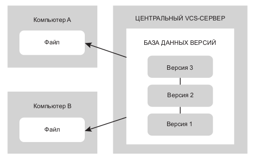

# Конспект-инструкция по Git и Visual Studio Code
_Дисклеймер. это личный конспект по контролю версий, git и VS Code. Он не претендует на полноту информации, в нем могут быть ошибки и т. п. Он создан исключительно для собственных нужд. В том случае, если вы не автор этого конспекта, но читаете его, то знайте, что вы используете его на свой страх и риск._

_В процессе обучения использовалась ОС ALT Linux Desktop. Автор описывал свой личный опыт для себя. Как будет работать программное обеспечение, описываемое в этом конспекте в другой среде автор не знает и не проверял. Имейте это в виду._

_Начало конспекта: 10.01.2023. Автор: М. Казачкин._

## Контроль версий
---
Конроль версий необходим для **сохранения** различных версий проектов и **возможности** возвращаться к ним. Одним из самых простых способов организовать контроль версий — это копирование файлов с рабочими версиями файлов в отдельные папки (рис. 1).

_**Рис. 1.** Ручной контрль версий копированием файлов_

Подобный способ организации контроля версий рабочий, но не удобный. Особенно проблематично в этом случае организовывать **совместную работу** с другими разработчиками в крупных проектах, занимающих **длительный срок**.

Существует несколько систем контроля версий. Одной из самых распространенных является Git. Изначально был разработан для контроля версий при работе на ядром Linux.

Git относится к распределенным системам контроля версий (Distributed Version Control System, DVCS). Такие системы позволяют не только организовать контроль версий, но и обеспечить совместную работу пользователей над проектами. Программные кленты создают полную зеркальную копию локального **репозитория** пользователя у других пользователей или на VCS-сервере.

_**Рис. 2.** Централизованное управление версиями_

Помимо Git существуют и другие DVCS, например Mercurial, Bazaar или Darcs.
## Git
---
### Общая информация

Для осуществления практически всех операций Git использует локальные файлы. В общем случае информация с других компьютеров не нужна.

Перед сохранением файлов Git рассчитывает контрольную сумму файлов, что делает невозможным изменения файлов без уведомления об этом Git.

Git можно использовать разными способами, однако предпочтительнее работать из командной строки (в терминале).

Работа в терминале позволяет выполнять все команды Git, в то время как большинство графических пользовательских интерфейсов (GUI) имеют ограничения. Кроме того, использование командной строки позволяет добиться единообразия работы с Git на любых системах и не зависить от доступности GUI.

### Три состояния Git
**! Важная информация !**

Файлы в Git могут находится в трех состояниях:
1. Зафиксированные
2. Модифицированные
3. Индексированные

Зафиксированное состояние (_commited_) означает, что файлы сохранены в локальной базе данных Git. Модифицированное состояние (_modified_) означает, что файл был изменен, но изменения пока не зафиксированны в базе данных Git. Индексированное состояние файлов (_staged_) означает, что текушая версия модифицированного файла предназначена для фиксации.

Переход файлов из одного состояния в другое продемонстрирован на рис. 3.

_**Рис. 3.** Рабочая папка, область индексирования и папка Git_

Папка `.git` хранит локальную базу данных репозитория и располагается в рабочей папке. Она по-умолчанию скрыта от пользователя.

### Установка Git
Дистрибутив Git можно скачать с [официального сайта](https://git-scm.com/ "Перейти на официальный сайт проекта Git") проекта. В разделе Downloads есть версии для Windows, Mac. 

В Linux необходимо воспользоваться штатным для установленного дистрибутива менеджером пакетов и установить актуальную версию Git из подключенных репозиториев. Список команд установки для конкретных дистрибутивов Linux приведен на странице загрузки.

В общем случае, установка Git в Linux выполняется пользователем root командой

    apt-get install git

Кроме основного пакета для установки из репозиториев, как правило, доступны пакеты с документацией к Git (на английском языке) и дополнительные инструменты, графические интерфейсы и т. п.

### Первая настройка Git

Настройка окружения Git, как правило, проводится один раз. Настройка производится опцией config, параметры которой задают значения переменных Git. Переменные хранятся в разных местах и могут иметь системное (system), пользовательское (global) или локальное значение.

Настройки каждого следующего уровня переопределяют настроки предыдущего. То есть, локальные настройки (файл `gitconfig` располагающийся в папке `.git` проекта) имеют приоритет выше, чем настройки пользователя (файл `~/.gitconfig`. Расположение зависит от дистрибутива).

После установки Git следует указать имя пользователя и адрес электронной почты. Эту информацию Git будет включать в каждую фиксируемую версию и она обязательно будет включаться в коммиты (_см. далее_).

Имя пользователя и адрес электронной почты задаются командами

    git config --global user.name "Ivan Smirnoff"
    git config --global user.email smirnoff@example.ru

Если для конкретного проекта требуется указать другие имя и адрес, но необходимо выполнить эти же команды без параметра `--global` в папке проекта.  

    git config user.name "Ivan Smirnoff"
    git config user.email smirnoff@example.ru

Для ввода сообщений Git желательно указать рекдатор, который будет использоваться для их редактирования. Без настройки Git будет использовать редактор по-умолчанию. Обычно это Vim. Однако, не все начинающие (и не только начинающие) могут использовать Vim. Поэтому лучше задать консольный редактор по-умолчанию. 

В Linux наиболее привычным интерфейсом для большинства пользователей обладает редактор консольного файлового менеджера Midnight Commander (mc). Чтобы задать его в качестве редактора по-умолчанию, необходимо выполнить команду

    git config --global core.editor mcedit

Или иную, где вместо `mcedit` вписать нужный редактор.

Проверка настроек осуществляется командой `git config --list`, которая выводит на экран список всех обнаруженных параметров. Например:

    $ git config --list

    user.name=Mikhail Kazachkin
    user.email=mikhail.kazachkin@yandex.ru
    core.editor=mcedit

## Команды Git
---

Перечень команд, описываемых в этом конспекте.
* --help
* &lt;command> -h
* init
* add
* status
* diff

### git --help
Список всех команд Git, синтаксис их использования и список опций выводится с git, запущенного с опцией `--help`. Пример:

    $ git --help
    usage: git [--version] [--help] [-C <path>] [-c <name>=<value>]
           [--exec-path[=<path>]] [--html-path] [--man-path] [--info-path]
           [-p | --paginate | -P | --no-pager] [--no-replace-objects] [--bare]
           [--git-dir=<path>] [--work-tree=<path>] [--namespace=<name>]
           [--super-prefix=<path>] [--config-env=<name>=<envvar>]
           <command> [<args>]
    ...

Запуск в терминале `git help -a` выведет полный список доступных команд.

### git &lt;command> -h

Команда git, запущенная с опцией `-h` выводит справку по этой команде. Пример:

    $ git init -h
    usage: git init [-q | --quiet] [--bare] [--template=<template-directory>] [--shared[=<permissions>]] [<directory>]
    ...

## git status
Команда `status` выводит отчет о состоянии файлов репозитория в папке. В том случае, когда в папке присутствуют отслеживаемые файлы в _модифицированные_ или _индексированные_ файлы (см. выше), выводит их список. Например:

    $ git status
    On branch master
    Changes not staged for commit:
      (use "git add <file>..." to update what will be committed)
      (use "git restore <file>..." to discard changes in working directory)
	    modified:   git_manual.md
    
    no changes added to commit (use "git add" and/or "git commit -a")

Если в папке репозиторий не был инициализирован, то выводится соответствующая информация:

    $ git status
    fatal: not a git repository (or any parent up to mount point /)
    Stopping at filesystem boundary (GIT_DISCOVERY_ACROSS_FILESYSTEM not set).

Полезные опции
* -s, --short — упрощенный вариант вывода. 

### git init
Команда `init` инициализирует репозиторий в запущенной папке. Резульатом выполнения

    $ git init
    ...
    Initialized empty Git repository in /home/user/example/.git/

будет созданная локальная база данных репозитория в папке `.git'. Слежение за файлами после создания репозитория **отсутствует**.

**! Важная информация !**

* Перед инициализацией репозитория в папке, рекомендуется проверить наличие ранее созданного репозитория командой `git status` (см. выше). При повтором запуске в папке `git init` происходит ре-инициализация репозитория. Если репозиторий работает нормально, то так делать не надо.

    Reinitialized existing Git repository in /home/user/example/.git/

* В состав репозитория входит папка, в которой он был инициализирован и все вложенные папки. Поэтому настоятельно не рекомендуется инициализировать репозиторий в корневых каталогов дисков и других папках, не содержаших проекты, требующие наличия контроля версий.

### git add
Команда `add` переводит файлы в состояние индексированных (см. три состояния файлов в Git выше). Это касается как ранее добавленных файлов, находящихся в состоянии модифицированных, так и новых файлов, ранее не учтенных Git.

С момента перевода ранее не отслеживаемых файлов в состояние индексированных, Git начинает слежение за ними.

Git выполняет индексирование файла в момент выполнения команды `add`. Если файл после индексации был модифицирован, то этот файл может одновременно находится в состоянии _модифицированного_ и _индексированного_. При _зафиксирован_ будет проиндексированный файл, а не модифицированный.

Пример использования:

    $ git add README

Опции команды задаются непосредственно после команды. Например:

    $ git add -A

Проверить, какие файлы получили статус _проиндексированных_ можно запустив Git с командой status — `$ git status` (см. выше). 

Полезные опции:
* -A, --all — добавляет в область индексации все отслеживаемые и неотслеживаемые файлы в папке.
* -i, --interactive — запуск команды `add` с последующим выбором команд и опций в интерактивном режиме.

### git diff

## Visual Studio Code
---
### Общая информация
Visual Studio Code (VS Code) — текстовый редактор, разработанный Microsoft для Windows, Linux и macOS. VS Code позволяет редактировать код для кроссплатформенной разработки приложений, в т. ч. веб- и облачных приложений. К редактору с помощью расширений есть возможность подключения отладчиков для различных языков программирования. Кроме того, VS Code имеет встроенные инструменты для работы с Git, подсветку синтаксиса языков программирования и разметки.

VS Code распространяется бесплатно и разрабатывается как программное обеспечение с открытым исходным кодом. Однако, конкретные сборки могут включать проприетарные инструменты от Microsoft.

В практических занятиях по Git и в дальнейшем будет использоваться VS Code.

### Установка Visual Studio Code
Дистрибутив VS Code можно скачать с [официального сайта](https://code.visualstudio.com/ "Перейти на официальный сайт проекта VS Code") проекта. В разделе Downloads есть версии для Windows, Mac. 

Установочные пакеты для Linux доступны не для всех дистрибутивов. При загрузке необходимо выбрать версию, совметимую с менеджером пакетов конкретного дистрибутива. Так пакет deb совместим с Debian, Ubuntu, rpm с CentOS, Fedora, Red Hat.

В отечественной Alt Linux имеетс возможность адаптировать пакет для дистрибутива с помощью Epm — единой команды управления пакетами,разработанной в компании Etersoft. Пакет epm устанавливатся шатным менеджером пакектов Alt Linux или пользователем root командой:

    apt-get install eepm

Пересборка rpm-пакета для Alt Linux остуществляется командой

    epm repack <file>

После пересборки пакета для дистрибутива, его установка осуществляется коммандой

    epmi <package> 

На момент написания конспекта, пакет epm, устанавливаемый с официальных репозиториев Alt Linux имеет ошибку, препятствующей пересборке пакета VS Code. Для нормальной пересборки необходимо установить актуальный пакет epm из стороннего источника. Например:

    apt-get install http://mirror.yandex.ru/altlinux/Sisyphus/noarch/RPMS.classic/eepm-x.xx.x-alt1.noarch.rpm

подставив вместо x.xx.x актуальную версию пакета и выполнив ее пользователем root. Этот вариант является предпочтительным. Другим вариантом является автообновление пакета epm с помощью команды

    epm ei

которая обновит менеджер пакетов epm. Выполнение команды может занять длительное время.

### VS Codium

Альтернативной Visual Studio Code является свободная версия VS Codium, основанная на открытом исходном коде VSC (форк), но лишенная некоторых инструментов, завязанных на инфраструктуру Microsoft. В частности, в VS Codium отключена телеметрия и вырезано брендирование.

Кроме того, по-умочанию VS Codium настроен на установку только свободных/открытых расширений из сервиса [Open VSX Registry](https://open-vsx.org/ "Перейти на сайт Open VSX Registry."), хотя и полностью совместим со всеми расширениями VS Code.

Установка VS Codium в Linux осуществляетсяс помощью стандартного менеджера пакетов или командой 

    sudo apt-get install codium

Для установки проприетарных в VS Codium расширений необходимо сменить источник расширений с Open VSX Registry на [Microsoft Visual Studio Code Marketplace](https://marketplace.visualstudio.com/ "Перейти на сайт Microsoft Visual Studio Code Marketplace").

Существует несколько вариантов замены галерени расширений в VS Codium. Конкретные инструкции по сменедоступна по [ссылке](https://github.com/VSCodium/vscodium/blob/master/DOCS.md#howto-switch-marketplace "Перейти на сайт с инструкцией по смене галереи расширений VS Codium") (англ.).
